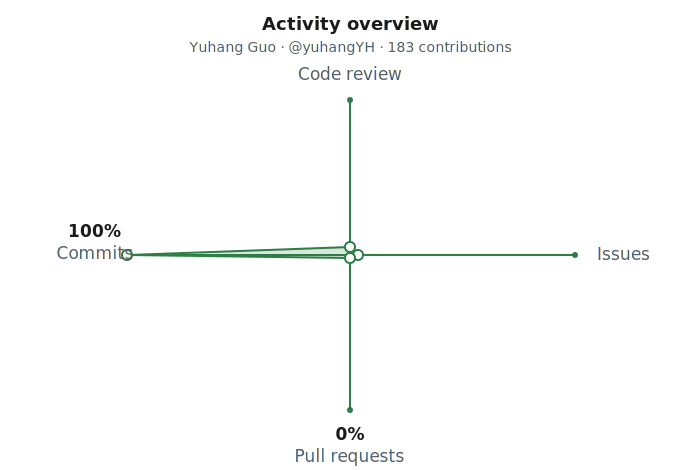

<h1 align="center">🚀 Featured projects</h1>

<em>Yuhang Guo · <a href="https://github.com/yuhangYH">@yuhangYH</a></em>

  <a href="./README.md">← Back to profile</a>

---

## 🧠 Research — TDA for EEG & seizure detection
| Repo | What it is |
|------|-----------|
| **[mv-afa-szcore](https://github.com/yuhangYH/mv-afa-szcore)** | MV-AFA: topology-aware multi-view fusion attention for EEG seizure detection · SzCORE benchmark |
| **[BioCAS2026-Benchmark](https://github.com/yuhangYH/BioCAS2026-Benchmark)** | BioCAS 2026 EEG seizure-detection benchmark |
| Dynamic-TDA / MV-AFA | CROCKER & zigzag follow-up to my multi-view seizure paper |

## 📊 Quant & finance
| Repo | What it is |
|------|-----------|
| quant-ai-hub | Bilingual quant-learning + ADIA-prep site · 🌐 GitHub Pages |
| CrunchDAO — *charming-lion* | Training-free scale detector for the ADIA Lab structural-break challenge |

## 🌐 Open-source web apps
| Repo | What it is |
|------|-----------|
| **[isochrona](https://github.com/yuhangYH/isochrona)** | Bilingual isochrone travel-time map · 🌐 GitHub Pages |
| **[zumba-hub](https://github.com/yuhangYH/zumba-hub)** | Self-learning hub for Zumba & Latin dance · 🌐 GitHub Pages |
| **abu-dhabi-foodie-map** | Trilingual static restaurant guide (460+ spots, expanded to Dubai) |

---

## 📈 GitHub activity

<picture>
  <source media="(prefers-color-scheme: dark)" srcset="./activity-overview-dark.svg">
  <source media="(prefers-color-scheme: light)" srcset="./activity-overview.svg">
  
</picture>

  
  

---

## 🛠️ Tech & tools

**Domains:** Topological data analysis · Persistent homology (ripser / giotto-tda / GUDHI) · EEG / biomedical signals · Time-series & change-point detection · Quantitative ML

---

<a href="./README.md">← Back to profile</a>

